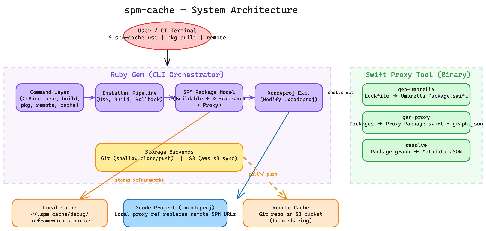
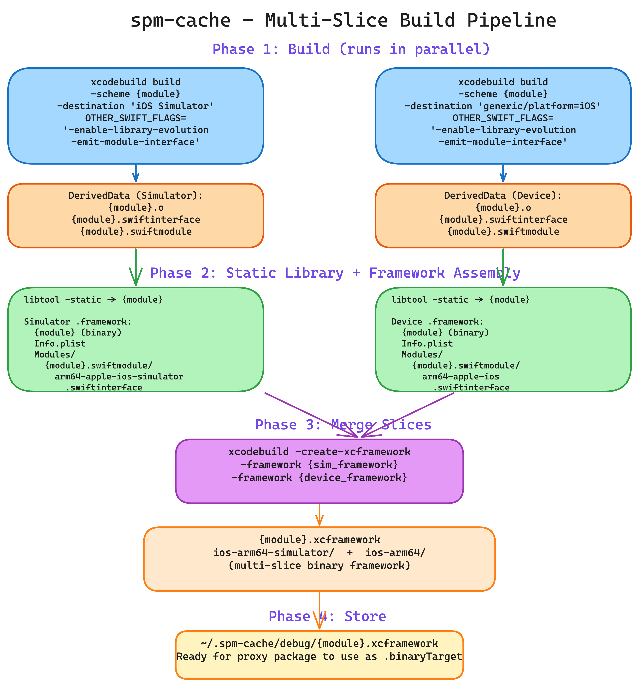

# spm-cache

Cache SPM (Swift Package Manager) dependencies as `.xcframework` binaries to dramatically reduce Xcode clean build times.

## How It Works

spm-cache prebuilds your SPM dependencies into `.xcframework` files and swaps them at the manifest level using an innovative **proxy package architecture**. When a cache hit occurs, Xcode uses the prebuilt binary instead of compiling from source. On cache miss, it automatically falls back to source compilation.

### Key Features

- **Proxy Package Architecture** - Seamless source/binary switching at the SPM manifest level
- **Automatic Cache Fallback** - Cache miss automatically falls back to source compilation
- **Swift Macro Support** - Prebuild and cache Swift macros as `.macro` binaries
- **Resource Bundle Handling** - Properly handles `Bundle.module` access in cached frameworks
- **Remote Cache** - Sync cache via Git or S3
- **Per-Configuration Caching** - Separate Debug and Release caches
- **Dependency Graph Visualization** - Interactive cachemap visualization

## Installation

```bash
gem install spm-cache
```

Or with Bundler:

```ruby
# Gemfile
gem "spm-cache"
```

```bash
bundle install
```

## Getting Started

1. Navigate to your Xcode project directory
2. Run the default command:
   ```bash
   spm-cache
   ```
   This integrates the proxy package and replaces source dependencies with cached binaries where available.

3. Build specific targets into the cache:
   ```bash
   spm-cache build Alamofire --sdk=iphonesimulator
   ```

4. Rollback to original state:
   ```bash
   spm-cache rollback
   ```

## CLI Commands

| Command | Description |
|---------|-------------|
| `spm-cache` (or `spm-cache use`) | Integrate cache (default) |
| `spm-cache build [TARGETS]` | Build targets into xcframeworks |
| `spm-cache off [TARGETS]` | Force source mode for targets |
| `spm-cache rollback` | Restore original project state |
| `spm-cache cache list` | List cached packages |
| `spm-cache cache clean [--all]` | Clean cache |
| `spm-cache pkg build TARGET` | Build single package to xcframework |
| `spm-cache remote pull` | Pull cache from remote |
| `spm-cache remote push` | Push cache to remote |

## Configuration

Create `spm-cache.yml` in your project root:

```yaml
ignore: []
ignore_local: false
ignore_build_errors: false
keep_pkgs_in_project: false
default_sdk: iphonesimulator
remote:
  debug:
    git: git@github.com:your-org/ios-cache.git
  release:
    s3:
      uri: "s3://bucket/path"
      creds: "~/.spm-cache/s3.creds.json"
```

## Architecture

spm-cache consists of two components:

1. **Ruby Gem** (`lib/spm_cache/`) - CLI orchestrator, xcodeproj manipulation, installer pipeline
2. **Swift Proxy Tool** (`tools/spm-cache-proxy/`) - SPM manifest generation and dependency graph resolution

### System Architecture



### Build Pipeline

spm-cache uses `xcodebuild` (not `swift build`) to compile dependencies with library evolution flags, then assembles multi-slice xcframeworks containing both simulator and device binaries.



```
Phase 1 - Build (per destination, parallel):
  xcodebuild build -scheme {module} -destination '{sim|device}'
    OTHER_SWIFT_FLAGS='-enable-library-evolution -emit-module-interface'
    -> .o files + .swiftinterface + .swiftmodule

Phase 2 - Static Library + Framework Assembly:
  libtool -static -> .a binary
  Assemble .framework (binary + Info.plist + Modules/.swiftmodule/)

Phase 3 - Merge Slices:
  xcodebuild -create-xcframework
    -framework {sim_framework}
    -framework {device_framework}
    -> {module}.xcframework (ios-arm64-simulator + ios-arm64)

Phase 4 - Store:
  Copy to ~/.spm-cache/debug/{module}.xcframework
```

### Key Concepts

- **Umbrella Package** - A synthetic `Package.swift` that references all project SPM dependencies in one place, enabling graph resolution.
- **Proxy Package** - Per-dependency `Package.swift` that switches between `.binaryTarget` (cache hit) and source target (cache miss).
- **Cachemap** - Graph of all dependencies with `hit`/`missed`/`ignored` status, used to drive build decisions and visualization.
- **Lockfile** (`spm-cache.lock`) - JSON snapshot of project SPM dependencies (packages, targets, platforms).

## Development

```bash
# Install dependencies
make install

# Build Swift proxy tool
make proxy.build

# Run tests
make test

# Format code
make format
```

## Project Structure

```
spm-cache/
├── bin/spm-cache              # CLI entry point
├── lib/spm_cache/             # Ruby gem
│   ├── command/               # CLAide commands (use, build, off, rollback, cache, pkg, remote)
│   ├── core/                  # Config, Lockfile, Sh, Git, Log, syntax mixins
│   ├── installer/             # Install pipeline + integration mixins
│   ├── spm/                   # SPM package model, buildable, xcframework, macro
│   ├── storage/               # Git + S3 remote cache backends
│   ├── xcodeproj/             # Xcodeproj gem extensions
│   └── assets/templates/      # ERB templates (plist, modulemap, cachemap HTML)
├── tools/spm-cache-proxy/     # Swift proxy tool
│   └── Sources/
│       ├── CLI/               # gen-umbrella, gen-proxy, resolve subcommands
│       └── Core/              # Cache, Lockfile, Resolver, Generators, Proxy
└── docs/                      # Documentation
```

## License

MIT
