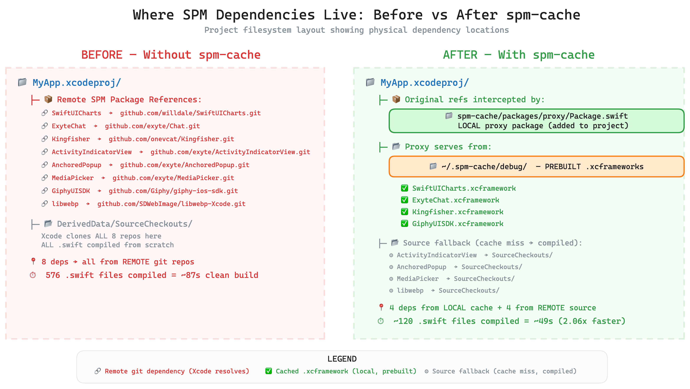

<div align="center">

# spm-cache

**Cache Swift Package Manager dependencies as `.xcframework` binaries — slash Xcode clean build times, transparently.**

[](https://rubygems.org/gems/spm-cache)
[](LICENSE)

[Installation](#installation) · [Quick Start](#quick-start) · [How It Works](#how-it-works) · [Commands](#cli-reference) · [Architecture](#architecture)

</div>

---

`spm-cache` prebuilds your SPM dependencies into `.xcframework` binaries and swaps them in at the manifest level using a **proxy-package architecture**. On a cache hit, Xcode links the prebuilt binary instead of compiling from source. On a cache miss, it transparently falls back to source compilation — **a cache hit never breaks a build.**

<div align="center">



</div>

## Why

Clean Xcode builds recompile every SPM dependency from source — even when nothing changed. For a project with dozens of packages, that's minutes of wasted time, on every machine, on every CI run.

`spm-cache` serves prebuilt binaries so clean builds skip dependency compilation entirely, while keeping source as the automatic fallback.

## Key Features

- **Proxy-Package Architecture** — seamless source ↔ binary switching at the SPM manifest level, no drag-and-drop.
- **Auto-Sync Diff Detection** — reads the Xcode project directly; detects SPM graph changes (`Package.resolved` + project refs) and auto-regenerates the proxy. **No separate manifest to maintain.**
- **Automatic Fallback** — cache miss transparently falls back to source compilation.
- **Swift Macro Support** — prebuild and cache Swift macros as `.macro` binaries.
- **Resource Bundles** — correctly handles `Bundle.module` access in cached frameworks.
- **Remote Cache** — sync across machines and CI via Git or S3.
- **Per-Configuration Caching** — separate Debug and Release caches.
- **Dependency Graph Visualization** — interactive `cachemap` of hit / miss / ignored status.
- **Auto-Sync Watch** — `spm-cache watch` auto-regenerates the cache proxy when `Package.resolved` or `project.pbxproj` changes (`--debounce=SECONDS`, `--once` for CI).
- **Watch Mode (use)** — `spm-cache use --watch` monitors `Package.resolved` and re-integrates on change.

## Installation

**Homebrew** (recommended):

```bash
brew install phuongddx/spm-cache/spm-cache
```

**RubyGems**:

```bash
gem install spm-cache
```

**Bundler** — add to your `Gemfile`:

```ruby
gem "spm-cache"
```

```bash
bundle install
```

## Quick Start

```bash
cd /path/to/your.xcodeproj/..   # your project root
spm-cache                       # integrate cache (default: `spm-cache use`)
spm-cache build Alamofire       # prebuild a target into the cache
spm-cache                       # re-run — cached binary is now linked
```

Roll back to the original project state any time:

```bash
spm-cache rollback
```

## How It Works

### 1. Proxy-Package swap

For each dependency, `spm-cache` generates a small proxy `Package.swift` that switches between a `.binaryTarget` (cache hit) and the original source target (cache miss). Xcode resolves against the proxy, so switching modes is a manifest-level operation — no project file surgery per dependency.

### 2. Build pipeline

`spm-cache` uses `xcodebuild` (not `swift build`) to compile dependencies with library-evolution flags, then assembles multi-slice `.xcframework`s containing both simulator and device binaries.

```
Phase 1 — Build (per destination, parallel):
  xcodebuild build -scheme {module} -destination '{sim|device}'
    OTHER_SWIFT_FLAGS='-enable-library-evolution -emit-module-interface'
    → .o + .swiftinterface + .swiftmodule

Phase 2 — Static lib + Framework assembly:
  libtool -static → .a
  assemble .framework (binary + Info.plist + Modules/.swiftmodule/)

Phase 3 — Merge slices:
  xcodebuild -create-xcframework
    -framework {sim_framework} -framework {device_framework}
    → {module}.xcframework (ios-arm64-simulator + ios-arm64)

Phase 4 — Store:
  copy to ~/.spm-cache/{config}/{module}.xcframework
```

### 3. Auto-Sync: zero-maintenance tracking

`spm-cache` reads your Xcode project directly — there is **no separate manifest** to keep in sync by hand. Every `spm-cache use` diffs the live SPM graph against the last run's snapshot and regenerates the proxy transparently.

- **Source of truth** — `Package.resolved` (resolved versions) + `project.pbxproj` SPM package references (local packages, un-resolved refs).
- **Snapshot** — `spm-cache.lock` records the exact package set from the last successful integration.
- **Fast path** — when the diff is empty *and* the proxy exists, integration is a near-instant no-op (skips regenerate/resolve/build).

```
# Added 2 SPM deps in Xcode, then ran spm-cache:
$ spm-cache
Detected: +2 packages (Foo, Bar). Regenerating proxy package.

# Nothing changed:
$ spm-cache
No changes detected. Proxy package up to date.
```

### spm-cache vs Scipio

The manifest-sync burden is Scipio's #1 friction point: every dependency change in Xcode requires a matching manual edit to a separate file, and forgetting produces stale or broken builds. `spm-cache` treats the Xcode project as the single source of truth.

| | **spm-cache** | **Scipio** |
|---|---|---|
| Dependency source | Reads `.xcodeproj` + `Package.resolved` directly | Separate `Package.swift` you create via `scipio init` |
| Add a dep | Add in Xcode → run `spm-cache` (auto-detected) | Add in Xcode → manually edit Scipio manifest |
| Update a version | Bump in Xcode → run `spm-cache` (auto-detected) | Bump in Xcode → manually update Scipio manifest |
| Remove a dep | Remove in Xcode → run `spm-cache` (auto-detected) | Remove in Xcode → manually edit Scipio manifest |
| Sync drift risk | None (single source of truth) | High — manifest drifts silently |
| First-run setup | Zero (just run `spm-cache`) | `scipio init` + curate manifest |

## CLI Reference

| Command | Description |
|---|---|
| `spm-cache` / `spm-cache use` | Integrate cache (default command) |
| `spm-cache build [TARGETS] [--rebuild]` | Build targets into xcframeworks (`--rebuild` also rebuilds cache hits) |
| `spm-cache off [TARGETS]` | Force source mode for targets |
| `spm-cache rollback` | Restore original project state |
| `spm-cache cache list` | List cached packages |
| `spm-cache cache clean [--all]` | Clean the cache |
| `spm-cache pkg build TARGET` | Build a single package to xcframework |
| `spm-cache remote pull` | Pull cache from remote |
| `spm-cache remote push` | Push cache to remote |

Global options: `--sdk`, `--config`, `--log-dir`, `--no-merge-slices`, `--no-library-evolution`.

## Configuration

Drop a `spm-cache.yml` in your project root:

```yaml
ignore: []                  # package identities to skip
ignore_local: false         # skip local packages
ignore_build_errors: false  # don't fail the run on per-pkg build errors
keep_pkgs_in_project: false # keep original package refs after integration
default_sdk: iphonesimulator
remote:
  debug:
    git: git@github.com:your-org/ios-cache.git
  release:
    s3:
      uri: "s3://bucket/path"
      creds: "~/.spm-cache/s3.creds.json"
```

## Architecture

`spm-cache` ships as two components:

1. **Ruby gem** (`lib/spm_cache/`) — CLI orchestrator, `xcodeproj` manipulation, installer pipeline.
2. **Swift proxy tool** (`tools/spm-cache-proxy/`) — SPM manifest generation and dependency-graph resolution.

<div align="center">

**System Architecture**


**Build Pipeline**


</div>

### Key Concepts

- **Umbrella Package** — synthetic `Package.swift` referencing all project SPM dependencies in one place, enabling graph resolution.
- **Proxy Package** — per-dependency `Package.swift` switching between `.binaryTarget` (hit) and source target (miss).
- **Cachemap** — graph of all dependencies with `hit`/`missed`/`ignored` status; drives build decisions and visualization.
- **Lockfile** (`spm-cache.lock`) — JSON snapshot of project SPM dependencies (packages, targets, platforms).

## Development

```bash
make install        # install Ruby dependencies
make proxy.build    # build the Swift proxy tool (release)
make test           # rspec
make format         # rubocop --auto-correct
```

### Agent Skills

Two bundled Claude agent skills for advanced workflows:

- **`skills/spm-cache`** — end-user usage skill: prerequisites, core workflow, SDK flags, config, remote cache, CI/CD patterns, troubleshooting.
- **`skills/spm-cache-issue`** — automated GitHub issue filing: collects diagnostics, classifies the issue, drafts and files it.

## Project Structure

```
spm-cache/
├── bin/spm-cache              # CLI entry point
├── lib/spm_cache/             # Ruby gem
│   ├── command/               # CLAide commands (use, build, off, rollback, cache, pkg, remote)
│   ├── core/                  # Config, Lockfile, Sh, Git, Log, syntax mixins
│   ├── installer/             # Install pipeline + integration mixins
│   ├── spm/                   # SPM package model, buildable, xcframework, macro
│   ├── storage/               # Git + S3 remote cache backends
│   ├── xcodeproj/             # Xcodeproj gem extensions
│   └── assets/templates/      # ERB templates (plist, modulemap, cachemap HTML)
├── tools/spm-cache-proxy/     # Swift proxy tool
│   └── Sources/
│       ├── CLI/               # gen-umbrella, gen-proxy, resolve subcommands
│       └── Core/              # Cache, Lockfile, Resolver, Generators, Proxy
└── docs/                      # Documentation + diagrams
```

## License

MIT
